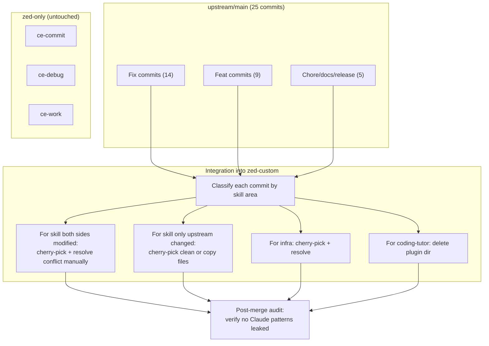

# Plan: Merge Upstream Improvements into Zed-Custom Branch

- **Type:** feat
- **Status:** active
- **Created:** 2026-06-20
- **Branches:** zed-custom, upstream/main

---

## Problem Frame

The `zed-custom` branch contains 21 commits of Zed-specific adaptations built on top of an older `main` snapshot. Upstream (EveryInc) has since published 25 new commits (v3.11.2 → v3.13.1) with bug fixes, new features, and infrastructure changes. These upstream improvements should be integrated into `zed-custom` while preserving the Zed-specific adaptations already made — not blindly merged, but selectively carried forward.

Key tension: upstream added features that rely on Claude Code-specific primitives (visual-probe server Node.js script, model tiers). `zed-custom` removed or simplified those. A plain `git merge upstream/main` would produce broad conflicts in 4 shared skill files and silently reintroduce Claude-only patterns.

---

## Requirements

| R-ID | Description                                                                                                                               | Source                     |
| ---- | ----------------------------------------------------------------------------------------------------------------------------------------- | -------------------------- |
| R1   | Apply upstream bug fixes to the skills that `zed-custom` has already adapted                                                              | Upstream commits           |
| R2   | Import upstream skill improvements that have no Zed-specific conflict (pure-import skills)                                                | Upstream commits           |
| R3   | Resolve merge conflicts in skills where both sides changed content                                                                        | zed-custom + upstream diff |
| R4   | Keep Zed adaptations intact: simple config resolution, no Claude-`$()` pre-resolution patterns, no bundled-script guards in skill content | zed-custom existing state  |
| R5   | Update shared infrastructure: AGENTS.md, CHANGELOG, README, plugin manifests                                                              | Upstream commits           |
| R6   | Remove coding-tutor plugin (upstream already deleted it)                                                                                  | Upstream commits           |
| R7   | Verify no Claude Code-specific patterns leaked into Zed-adapted skills                                                                    | Post-merge audit           |
| R8   | Do NOT touch zed-only skills (ce-commit, ce-debug, ce-work) — upstream didn't modify them                                                 | Scope boundary             |

---

## Scope Boundaries

**In scope:**

- Skill-by-skill integration of upstream changes into `zed-custom`
- Conflict resolution for ce-brainstorm, ce-plan, ce-compound, ce-code-review
- Import of upstream-only changes (ce-ideate, ce-proof, ce-product-pulse, ce-release-notes, ce-resolve-pr-feedback, ce-setup)
- Infrastructure files: AGENTS.md, CHANGELOG, README, plugin.json per-platform
- Coding-tutor plugin removal
- Post-merge validation

**Out of scope:**

- Adding new Zed-specific features or skills
- Refactoring existing Zed adaptations
- Porting skills or features that are inherently Claude Code-only (e.g. visual-probe Server.js)

---

## High-Level Technical Design

### Merge Strategy

Avoid `git merge upstream/main` directly — it creates a merge commit and produces unresolvable multi-file conflicts. Instead, use a **cherry-pick + manual integration** strategy:

**Rationale for cherry-pick + manual over merge commit:**

- Merge commit drags ALL upstream changes across the boundary, including ones not relevant to zed-custom
- Cherry-pick lets us select only commits that touch in-scope areas
- Manual conflict resolution in each skill gives control over what patterns survive
- No merge commit noise in zed-custom history

### Conflict Areas Summary

| Skill          | Upstream added                                                                                                                   | zed-custom removed/simplified                                                    | Resolution strategy                                                                      |
| -------------- | -------------------------------------------------------------------------------------------------------------------------------- | -------------------------------------------------------------------------------- | ---------------------------------------------------------------------------------------- |
| ce-brainstorm  | visual-probe-server.js (418 lines), visual-probes.md (128 lines), Model Tiers section, visual-probe gate logic, SKILL.md updates | Simplified config resolution, removed Model Tiers, removed visual-probe tripwire | Take upstream content, remove Node.js server and Model Tiers, keep simplified config     |
| ce-plan        | Output mode enhancements, handoff reference updates, config resolution optimization                                              | `target: zed` frontmatter, simplified config one-liner                           | Merge both: keep `target: zed` + upstream output logic                                   |
| ce-code-review | Thematic triage grouping (grouping:auto/off/always), triage groups in validation flow                                            | Removed grouping feature entirely                                                | Keep zed-custom's simplified version — grouping is Claude-centric UX                     |
| ce-compound    | Validate-frontmatter.py guard pattern (existence guard, manual fallback)                                                         | Simplified to direct `python3 scripts/...` call                                  | Use upstream's guard pattern (it's more portable), keep zed-custom's simplified phrasing |

---

## Implementation Units

### U1. Classify and Cherry-Pick Upstream Commits

**Goal:** Identify which upstream commits need integration and apply them via cherry-pick with conflict markers.

**Requirements:** R1, R2, R3

**Dependencies:** None

**Files:**

- `plugins/compound-engineering/` (various — cherry-picked commits touch multiple files)
- `plugins/coding-tutor/` (deletion)

**Approach:**

1. From `zed-custom`, cherry-pick upstream commits in chronological order that touch in-scope areas
2. For commits with conflicts, stop and resolve per skill-specific unit (U2-U8 below)
3. For commits that touch only out-of-scope areas (e.g. release automation in `.github/`), skip entirely
4. Do NOT cherry-pick `visual-probe-server.js` introduction — that file will be handled in U2
5. Commit message format: `fix(upstream-merge): cherry-pick <orig-msg>` for clean picks; `fix(upstream-merge): resolve conflict for <skill>` for manual resolutions

**Test scenarios:**

- Cherry-pick succeeds for commits touching only ce-ideate, ce-proof, ce-product-pulse, ce-release-notes, ce-resolve-pr-feedback, ce-setup — verify no conflicts
- Cherry-pick stops with conflicts for ce-brainstorm, ce-plan, ce-code-review, ce-compound — verify conflict markers are present
- Commit `a10ac3f2` (coding-tutor removal) applied — verify coding-tutor directory deleted
- Commits touching `.github/` or `src/` (CLI) are skipped — verify no changes to these areas

**Test expectation:** All cherry-pick operations produce expected result (clean or conflict). Verify with `git cherry -v`.

**Verification:** Upstream feature commits exist in zed-custom history after cherry-pick.

### U2. Resolve ce-brainstorm Conflict

**Goal:** Integrate upstream ce-brainstorm improvements while keeping Zed adaptations.

**Requirements:** R1, R4, R7

**Dependencies:** U1 (cherry-pick creates conflict markers)

**Files:**

- `plugins/compound-engineering/skills/ce-brainstorm/SKILL.md` (resolve conflict)
- `plugins/compound-engineering/skills/ce-brainstorm/references/visual-probes.md` (DO NOT create — skip file)
- `plugins/compound-engineering/skills/ce-brainstorm/scripts/visual-probe-server.js` (DO NOT create — skip file)
- `plugins/compound-engineering/skills/ce-brainstorm/references/brainstorm-sections.md` (resolve conflict)
- `plugins/compound-engineering/skills/ce-brainstorm/references/handoff.md` (resolve conflict)
- `plugins/compound-engineering/skills/ce-brainstorm/references/html-rendering.md` (resolve conflict)
- `plugins/compound-engineering/skills/ce-brainstorm/references/markdown-rendering.md` (resolve conflict)
- `plugins/compound-engineering/skills/ce-brainstorm/references/universal-brainstorming.md` (resolve conflict)

**Approach:**

1. In SKILL.md: take upstream's version for Phase 0 structure and Phase 1.3 visual-probe gate; keep zed-custom's simplified config resolution (one-liner); remove Model Tiers section (Zed has no model-based tiering); remove visual-probe tripwire references that point to `scripts/visual-probe-server.js`
2. Do NOT create `scripts/visual-probe-server.js` or `references/visual-probes.md` — these are Claude Code-specific and not useful in Zed
3. For reference files (html-rendering, markdown-rendering, etc.): take upstream's updated content unless it adds Claude-specific `$()` pre-resolution patterns; keep zed-custom's simplified approach
4. For `handoff.md` and `brainstorm-sections.md`: merge both, keeping upstream's section additions but preserving zed-custom's simplified config text

**Patterns to follow:**

- Existing zed-custom pattern: `!`cat "$(git rev-parse --show-toplevel ...)/.compound-engineering/config.local.yaml" 2>/dev/null || echo '**NO_CONFIG**'`
- Existing upstream pattern for reference files: structured Phase references with rendering format gate

**Test scenarios:**

- SKILL.md: confirm no mention of `scripts/visual-probe-server.js`
- SKILL.md: confirm Model Tiers section does NOT exist
- SKILL.md: confirm config resolution uses one-liner, not multi-line `$()` pre-resolution
- SKILL.md: confirm any `target: zed` frontmatter is preserved (if present in zed-custom already)
- visual-probes.md: file does NOT exist
- visual-probe-server.js: file does NOT exist
- Each reference file: no `$CLAUDE_` or `$()` pre-resolution patterns
- Upstream bug fixes (visual-probe gate fix `c759a260`, handoff changes) are reflected in resolved content

**Verification:** `git diff zed-custom upstream/main -- plugins/compound-engineering/skills/ce-brainstorm/` shows only expected differences (no visual-probe server, no Model Tiers).

### U3. Resolve ce-plan Conflict

**Goal:** Integrate upstream ce-plan changes while preserving Zed-specific frontmatter and simplified config.

**Requirements:** R1, R4, R7

**Dependencies:** U1

**Files:**

- `plugins/compound-engineering/skills/ce-plan/SKILL.md` (resolve conflict)
- `plugins/compound-engineering/skills/ce-plan/references/html-rendering.md` (resolve conflict)
- `plugins/compound-engineering/skills/ce-plan/references/markdown-rendering.md` (resolve conflict)
- `plugins/compound-engineering/skills/ce-plan/references/plan-handoff.md` (resolve conflict)
- `plugins/compound-engineering/skills/ce-plan/references/plan-sections.md` (resolve conflict)
- `plugins/compound-engineering/skills/ce-plan/references/universal-planning.md` (resolve conflict)

**Approach:**

1. In SKILL.md: keep `target: zed` frontmatter from zed-custom; keep zed-custom's simplified config resolution one-liner; take upstream's output mode resolution logic and plan-handoff routing updates
2. For reference files: take upstream's updated content unless it adds `$()` pre-resolution patterns
3. Upstream added `status: active` check to deepening detection — keep this improvement
4. Upstream renamed "Publish to Proof" → "Open in Proof" — keep this change

**Patterns to follow:**

- Existing zed-custom config resolution pattern
- Upstream's Phase 0.x output mode handling

**Test scenarios:**

- SKILL.md: frontmatter includes `target: zed`
- SKILL.md: config resolution uses one-liner, not multi-line approach
- SKILL.md: "Publish to Proof" is now "Open in Proof" (upstream change)
- Reference files: no `$CLAUDE_` or `$()` pre-resolution patterns
- SKILL.md: `status: active` deepening check is present (upstream improvement)

**Verification:** `git diff zed-custom upstream/main -- plugins/compound-engineering/skills/ce-plan/` shows only expected differences (target:zed, simplified config).

### U4. Resolve ce-code-review Conflict

**Goal:** Keep zed-custom's simplified code review (no thematic triage), take upstream bug fixes that don't depend on grouping.

**Requirements:** R1, R4, R7

**Dependencies:** U1

**Files:**

- `plugins/compound-engineering/skills/ce-code-review/SKILL.md` (resolve conflict)
- `plugins/compound-engineering/skills/ce-code-review/references/review-output-template.md` (resolve conflict)

**Approach:**

1. In SKILL.md: keep zed-custom's version as base — it already removed thematic triage grouping intentionally; upstream's `grouping:` argument handling and triage group logic should NOT be revived
2. Take upstream changes that are independent of grouping:
   - Validation step improvements (validator failure handling for P0/P1)
   - Better phrasing for orchestrator direct verification
   - Surface green-but-unverifiable edits guidance
3. For review-output-template.md: keep zed-custom's simpler version (no triage group sections)

**Patterns to follow:**

- zed-custom's simplified review flow (no grouping, no triage groups)

**Test scenarios:**

- SKILL.md: no `grouping:` argument handling exists
- SKILL.md: no Triage Groups section
- SKILL.md: validation improvements from upstream present (P0/P1 degraded handling)
- review-output-template.md: no triage groups section
- SKILL.md: no `Grouping is presentation, not a mode` statement

**Verification:** Review skill produces output without triage group section.

### U5. Resolve ce-compound Conflict

**Goal:** Take upstream's improved validate-frontmatter.py guard pattern while keeping zed-custom's simplified flow.

**Requirements:** R1, R4, R7

**Dependencies:** U1

**Files:**

- `plugins/compound-engineering/skills/ce-compound/SKILL.md` (resolve conflict)
- `plugins/compound-engineering/skills/ce-compound-refresh/references/per-action-flows.md` (resolve conflict)

**Approach:**

1. In SKILL.md: upstream added a more robust validate-frontmatter.py guard with existence guard and manual fallback; zed-custom simplified it to a direct `python3 scripts/...` call
2. Take upstream's guard pattern — it's more portable and matches the project's platform-agnostic philosophy (existence guard on `${CLAUDE_SKILL_DIR}` with manual checklist fallback)
3. Keep zed-custom's simplified phrasing where it reduces verbosity, as long as the guard logic is preserved
4. For per-action-flows.md: merge upstream changes into zed-custom's version

**Test scenarios:**

- SKILL.md: validate step includes existence guard or direct call — either is acceptable
- SKILL.md: validator run logic is present and functional
- per-action-flows.md: upstream changes merged in

**Verification:** `ce-compound` can run validate-frontmatter.py successfully.

### U6. Import Upstream-Only Skill Changes

**Goal:** Bring in upstream improvements for skills that zed-custom did NOT modify.

**Requirements:** R2

**Dependencies:** U1 (cherry-pick handles these cleanly)

**Files:**

- `plugins/compound-engineering/skills/ce-ideate/SKILL.md` (take upstream version)
- `plugins/compound-engineering/skills/ce-ideate/references/divergent-ideation.md` (new file — take upstream version)
- `plugins/compound-engineering/skills/ce-ideate/references/html-rendering.md` (new file — take upstream version)
- `plugins/compound-engineering/skills/ce-ideate/references/ideation-sections.md` (new file — take upstream version)
- `plugins/compound-engineering/skills/ce-ideate/references/markdown-rendering.md` (new file — take upstream version)
- `plugins/compound-engineering/skills/ce-ideate/references/post-ideation-workflow.md` (take upstream version)
- `plugins/compound-engineering/skills/ce-ideate/references/universal-ideation.md` (take upstream version)
- `plugins/compound-engineering/skills/ce-proof/SKILL.md` (take upstream version — HITL rewrite)
- `plugins/compound-engineering/skills/ce-proof/references/hitl-review.md` (delete — upstream removed it)
- `plugins/compound-engineering/skills/ce-product-pulse/SKILL.md` (take upstream version)
- `plugins/compound-engineering/skills/ce-release-notes/SKILL.md` (take upstream version)
- `plugins/compound-engineering/skills/ce-resolve-pr-feedback/references/full-mode.md` (take upstream version)
- `plugins/compound-engineering/skills/ce-setup/references/config-template.yaml` (take upstream version)

**Approach:**

1. These skills should cherry-pick cleanly since zed-custom didn't touch them
2. After cherry-pick, verify each file contains patterns compatible with Zed:
   - No `$CLAUDE_` environment variables without graceful fallback
   - No bundled-script patterns that assume Claude Code path resolution
3. If any files fail the check, adapt them using consistent patterns (config one-liner, no pre-resolution claims)
4. For ce-ideate: upstream made substantial changes (Fable model improvements, research file distillation, HTML-first docs). These are new capabilities that work in Zed as-is since they're content-focused, not platform-specific
5. For ce-proof: upstream replaced HITL review loop with one-way publish. Verify this doesn't conflict with the existing removed feature
6. For hitl-review.md: upstream deleted this file (393 lines) — ensure it's also removed in zed-custom

**Test scenarios:**

- ce-ideate: SKILL.md and all reference files present and functional
- ce-ideate: no Claude-specific patterns found in files
- ce-proof: HITL review loop properly replaced with one-way publish
- ce-proof: hitl-review.md deleted
- ce-product-pulse: upstream changes applied
- ce-release-notes: upstream changes applied
- ce-resolve-pr-feedback: full-mode.md updated with node ID fix
- ce-setup: config-template.yaml updated

**Verification:** Each skill's core functionality (reading files, dispatching agents) works in Zed context.

### U7. Resolve Infrastructure Changes

**Goal:** Update shared files that both upstream and zed-custom modified.

**Requirements:** R5

**Dependencies:** U1

**Files:**

- `plugins/compound-engineering/AGENTS.md` (resolve conflict)
- `plugins/compound-engineering/CHANGELOG.md` (resolve conflict)
- `plugins/compound-engineering/README.md` (resolve conflict)
- `plugins/compound-engineering/.claude-plugin/plugin.json` (resolve conflict)
- `plugins/compound-engineering/.codex-plugin/plugin.json` (resolve conflict)
- `plugins/compound-engineering/.cursor-plugin/plugin.json` (resolve conflict)
- `.claude-plugin/marketplace.json` (resolve conflict)

**Approach:**

1. AGENTS.md: upstream added content about `codex` target and agent platform ports; zed-custom modified platform-specific variables section. Merge both — keep upstream's new-service announcements, keep zed-custom's Zed-specific edits
2. CHANGELOG.md: upstream added release entries (v3.11.2 → v3.13.1). Keep them — they're chronological records. zed-custom may have its own entries as well; merge both sets
3. README.md: upstream added contribution expectations text. Keep it — irrelevant to Zed usage but harmless
4. plugin.json files: upstream bumped version numbers (v3.11.2 → v3.13.1). Accept upstream version — these are release-owned
5. marketplace.json: allow upstream to take precedence (release-owned metadata)

**Test scenarios:**

- AGENTS.md: contains both upstream contributions section and zed-custom's platform variable guidance
- CHANGELOG.md: contains upstream release entries from v3.11.2 through v3.13.1, plus any zed-custom entries
- plugin.json files: version matches upstream (v3.13.1)
- README.md: contribution expectations present
- marketplace.json: matches upstream version

**Verification:** `git diff upstream/main -- plugins/compound-engineering/AGENTS.md` shows only expected zed-custom-specific diffs.

### U8. Remove Coding-Tutor Plugin

**Goal:** Apply upstream's removal of the deprecated coding-tutor plugin.

**Requirements:** R6

**Dependencies:** U1 (cherry-pick of commit `a10ac3f2`)

**Files:**

- `plugins/coding-tutor/` (entire directory tree — delete)

**Approach:**

1. Upstream commit `a10ac3f2` removes the entire `plugins/coding-tutor/` directory
2. Cherry-pick this commit — it should apply cleanly since zed-custom didn't modify coding-tutor differently from upstream's base

**Test scenarios:**

- `plugins/coding-tutor/` directory does not exist
- No references to `coding-tutor` in plugin manifests (plugin.json files)

**Verification:** `ls plugins/coding-tutor` returns "No such file or directory".

---

## Risk Analysis

| Risk                                                                          | Likelihood | Impact | Mitigation                                                                                             |
| ----------------------------------------------------------------------------- | ---------- | ------ | ------------------------------------------------------------------------------------------------------ |
| Cherry-pick order issues (conflicts cascade)                                  | Medium     | Medium | Cherry-pick in chronological order; resolve U2-U8 conflicts sequentially                               |
| Upstream visual-probe server accidentally resurrected                         | Low        | Medium | Explicit `git rm` or `git checkout` skip for visual-probe files; verified in U2 tests                  |
| Claude-specific pattern leaks into imported skills                            | Medium     | Low    | Post-merge audit (R7); grep for `$CLAUDE_`, `CLAUDE_SKILL_DIR`, `$()` pre-resolution in imported files |
| ce-ideate has hidden Claude Code dependency                                   | Low        | Medium | Manual review of ce-ideate SKILL.md after import; verify no platform-specific assumptions              |
| Merge conflict in ce-compound is harder than expected (different file shapes) | Medium     | Low    | Both versions differ significantly; fallback: accept upstream version and reapply zed-custom edits     |

---

## Deferred Decisions

| Question                                                        | Why deferred                                                                                                              | When to resolve                                     |
| --------------------------------------------------------------- | ------------------------------------------------------------------------------------------------------------------------- | --------------------------------------------------- |
| Whether to create `visual-probe-server.js` for Zed              | Visual probes rely on Node.js server + HTML rendering, which is Claude-centric. If Zed gains visual capabilities, revisit | Future upstream release with non-HTML visual system |
| Whether to re-enable thematic triage grouping in ce-code-review | Grouping is presentation-level and doesn't affect review accuracy. zed-custom removed it for simplicity                   | If user requests it                                 |
| Marketplace metadata synchronization                            | `.claude-plugin/` and marketplace files are release-owned; upstream version takes precedence                              | On next upstream release                            |

---

## System-Wide Impact

- **zed-custom branch** gains all upstream improvements while preserving Zed adaptations
- **ce-commit, ce-debug, ce-work** (zed-only skills) — untouched, fully functional
- **ce-ideate** gets major improvements from upstream (Fable model support, research distillation, HTML output)
- **ce-proof** loses HITL review feature (upstream replaced it with one-way publish)
- **coding-tutor** plugin removed (deprecated upstream)
- **Post-merge history:** clean linear history through cherry-picks; no merge commits

---

## Verification

After all U1-U8 completed:

1. `git cherry upstream/main zed-custom` — shows which upstream commits were picked
2. Grep for Claude-only patterns: `grep -rn 'CLAUDE_SKILL_DIR\|CLAUDE_PLUGIN_ROOT\|claude-skill-dir' plugins/compound-engineering/skills/` — should have zero or well-guarded matches
3. Visual probe files should not exist: `ls plugins/compound-engineering/skills/ce-brainstorm/scripts/visual-probe-server.js` → error
4. `git log --oneline zed-custom --not upstream/main` — shows all zed-custom commits including the cherry-picks
5. `bun test` — verify CLI and converter tests pass (if applicable)
6. Manual review of each resolved conflict area for consistency
